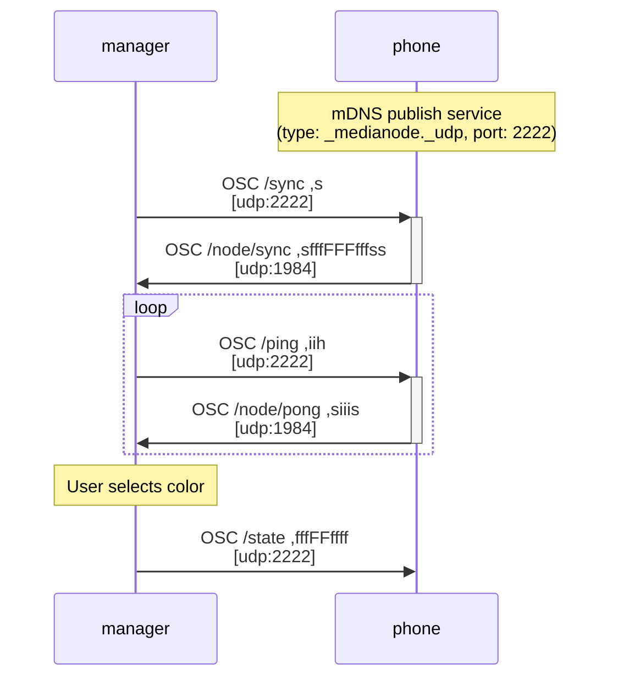

# Manager Communication using OSC

The manager is developped by Artificiel: [https://gitlab.artificiel.org/projets/121_nodes](https://gitlab.artificiel.org/projets/121_nodes)

### Sequence diagram of manager-phone communication

Use this live editor: https://mermaid.live



## `osc_dump` output of some messages from the Manager

```
/ping ,iih 68 1 1687185440637
/ping ,iih 69 1 1687185445637
```

```
/sync ,s
```

```
/state ,fffFFffff 0.0 0.0 0.0 False False 0.0 0.0 0.10000000149011612 0.0
```

## `tcpdump` output of some messages from the Manager

Using `sudo tcpdump -i any port 2222 and udp -s0 -X`

```
10:56:14.137860 IP rog.fil.umontreal.ca.55733 > rog.fil.umontreal.ca.2222: UDP, length 48
	0x0000:  4500 004c 4530 4000 4011 112c 0a39 e7e9  E..LE0@.@..,.9..
	0x0010:  0a39 e7e9 d9b5 08ae 0038 e48e 2f73 7461  .9.......8../sta
	0x0020:  7465 0000 2c66 6666 4646 6666 6666 0000  te..,fffFFffff..
	0x0030:  0000 0000 0000 0000 0000 0000 0000 0000  ................
	0x0040:  0000 0000 3f00 0000 0000 0000            ....?.......
```

State with color red set to 255 (float as 1.0). We see that content starts at `0x0030`. Every float takes 4 bytes (ex: `3f80 0000`), and we have 7 of them. The `False` does not take any byte.

```
14:57:56.338687 IP rog.fil.umontreal.ca.57978 > rog.fil.umontreal.ca.2222: UDP, length 48
	0x0000:  4500 004c 8398 4000 4011 d2c3 0a39 e7e9  E..L..@.@....9..
	0x0010:  0a39 e7e9 e27a 08ae 0038 e48e 2f73 7461  .9...z...8../sta
	0x0020:  7465 0000 2c66 6666 4646 6666 6666 0000  te..,fffFFffff..
	0x0030:  3f80 0000 0000 0000 0000 0000 0000 0000  ?...............
	0x0040:  0000 0000 3f00 0000 0000 0000            ....?.......
```

## Out of date documentation of protocol OSC with the Manager

Notes received by email:

```
PROTOCOLE OSC

INCOMING:    /sync s, qui est le serveur qui demande au téléphone sa configuration actuelle. le s est l'adresse IP du serveur, le device doit y renvoyer un paquet ses réponses

OUTGOING:   /node/sync s f f f b b b f f f s s
  1 s UUID
  2 f 0..1 red
  3 f 0..1 green
  4 f 0..1 blue
  5 b 0..1 false (ignore)
  6 b 0..1 false (ignore)
  7 b 0..1 true la première fois, false ensuite
  8 f 0..1 niveau de batterie
  9 f 0.0  (ignore)
  10 f 0..1 brightness
  11 f 0.0 (ignore)
  12 s build_number en string
  13 s device_name

INCOMING: /ping i en envoyant un /pong à l'adresse IP du serveur, port 1984:

OUTGOING: /node/pong s i i i s
   1 uuid
   2 le i du /ping reçu
   3 0 (ignore)
   4 0 (ignore)
  5 device_name

INCOMING:     /state f f f b b f f f f
   en ordre:
   1 f red 0..1
   2 f green 0..1
   3 f blue 0..1
   4 b false (ignore)
   5 b false (ignore)
   6 f brightness 0..1
   7 f 0.0 (ignore)
   8 f intensity 0..1
   9 f sharpness 0.11

(pas de réponse à celui-là)
```
