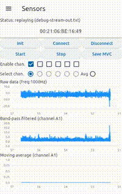
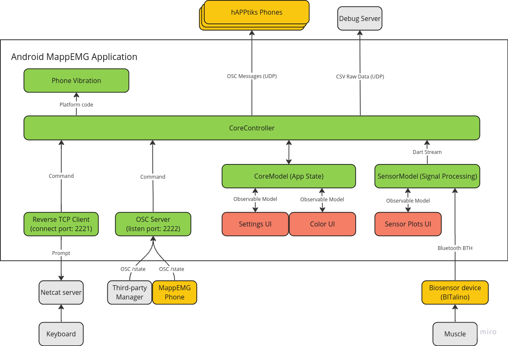
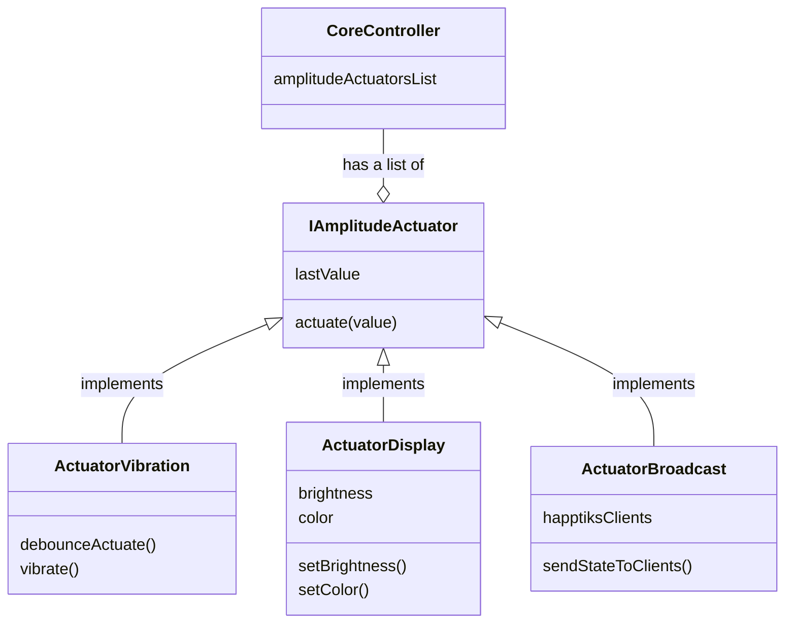
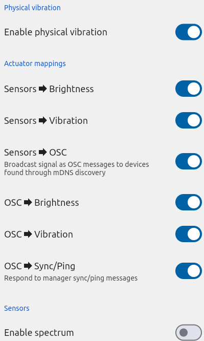
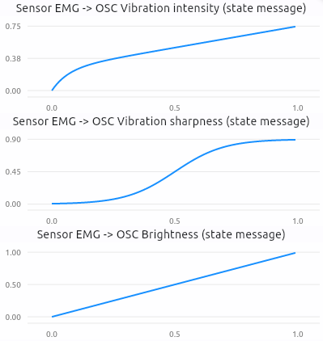

# MappEMG port to Dart/Flutter for mobile devices

This repository provides a standalone mobile application that implements the full MappEMG pipeline. It is developped using the [Dart programming language](https://dart.dev/) with the [Flutter UI framework](https://flutter.dev/). It runs on Android mobile devices.

This standalone app does the processing, mapping, distribution and presentation of the EMG signal acquired from a bluetooth enabled [BITalino](https://www.pluxbiosignals.com/collections/bitalino) device.

The app has been developped as a biomedical engineering intership project for the [S2M Laboratory of Simulation and Movement Modelling](https://www.facebook.com/s2mlab/), at the Université de Montréal.



## Quickstart

Here is an overview of the steps to run the MappEMG pipeline application.

1. Install MappEMG app on an Android phone using the APK file in [releases/](/releases/)
2. Place EMG electrodes on target muscle
3. Connect EMG electrodes to BITalino device and switch power ON
4. Pair phone's Bluetooth with BITalino device
5. Launch MappEMG app
6. In _Sensors_ screen, init and connect to BITalino
7. Start acquisition (BITalino LED should be flashing if successful)
8. Save Maximum Voluntary Contraction (MVC)
9. Use as standalone app for visualizing EMG signal and envelope, or launch on multiple phones to stream signal

# Table of Contents

- [Overview](#overview)
  - [What is MappEMG](#what-is-mappemg)
  - [What is hAPPtiks](#what-is-happtiks)
  - [Conceptual split of MappEMG and hAPPtiks](#conceptual-split-of-mappemg-and-happtiks)
  - [Supported Platforms](#supported-platforms)
- [How to Install](#how-to-install)
- [How to Run](#how-to-run)
- [How to Develop](#how-to-develop)
- [Implementation of MappEMG pipeline](#implementation-of-mappemg)
  - [Architecture](#architecture)
  - [Settings](#settings)
  - [Constants](#constants)
  - [Signal Processing](#signal-processing)
  - [Normalization and Mapping](#normalization-and-mapping)
  - [hAPPtiks Node Discovery](#happtiks-node-discovery)
  - [Data Streaming](#data-streaming)
- [Implementation of hAPPtiks (client-side)](#implementation-of-happtiks-client-side)
  - [Command Channels](#command-channels)
  - [Compatibility with third-party "Manager"](#compatibility-with-third-party-manager)
- [Functional and UI Tests](#tests)
- [Tools and Scripts](#tools-and-scripts)

# Overview

## What is MappEMG

Here is an excerpt of the [original release of MappEMG](https://github.MappEMG):

> MappEMG allows the audience to experience the performer's muscle effort, an essential component of music performance typically unavailable for direct visual observation. The goal is thus to give the listeners access, through haptic vibrations, to an intimate and non-visible dimension of the musicians' bodily experience.

The original release of the MappEMG pipeline provided a python server to receive the EMG signal data from a Bitalino or Delsys device, and given a pre-recorded MVC, could stream OSC messages to discovered [hAPPtiks](#what-is-happtiks) clients.

The current release (this repository) is a Dart/Flutter port of the pipeline as a standalone application for mobile phones that provides feature parity with the original release.

For more information on whole MappEMG project, check out [this paper](https://nime.pubpub.org/pub/kmn0rbyp/release/1)!

## What is hAPPtiks

hAPPtiks is the client of the MappEMG pipeline. It runs on a mobile phone and serves as an actuator in the hands of the audience. It receives OSC messages that set the brightness and vibration of the phone during EMG signal streaming of a live performance.

## Conceptual split of MappEMG and hAPPtiks

This project in this repository provides a single app that is used for both the hAPPtiks client and the MappEMG server.

Although the app is both a [Server](#implementation-of-mappemg) and a [Client](#implementation-of-happtiks-client-side), it makes sense to conceptually split the two responsabilities and document them as separate concerns.

The **MappEMG** server-side is the one that receives raw signal data from the [biosignal hardware](#supported-biosignal-hardware-platforms), filters the signal, and send it to the controller. The [signal is mapped](#normalization-and-mapping) to "output values" in a linear or non-linear way. The raw and processed signals are displayed in the user interface as time series.

The MappEMG server-side is also responsible to listen on the network for discovering other apps (hAPPtiks, the _clients_, also called _nodes_). These nodes can be either another Android device running the same app, or a compatible device, like the iOS native app that handle [OSC State messages](#osc-udp-channel) and behave accordingly.

The **hAPPtiks** client-side part of the application has two main responsabilities: being [discoverable](#happtiks-node-discovery) and act as an actuator when handling [OSC State messages](#osc-udp-channel).

hAPPtiks actuates the OSC State messages by changing the [vibration](#vibration) and the [brightness](#brightness) of the device.

## Supported Platforms

This project has been developed for **Android** and it is the primary supported platform for the app.

However, it has been developed using the Dart language with the goal to have a cross-platform app for both Android and iOS. The project has not been tested yet on iOS, but all the dependency libraries support iOS, therefore testing it should be quite straighforward.

A Linux desktop has also been used for development, but the only [bisignal hardware implementation](#supported-biosignal-hardware-platforms) requires the Java SDK that is not available on this platform. Therefore, the bluetooth sensor is replaced by a _replay_ signal feature (read from a file).

For EMG signal acquisition, the [BITalino](https://www.pluxbiosignals.com/collections/bitalino) biosignal platform is supported.

# How to Install

The folder [releases](/releases/) contains APK files that can be used to install on any recent Android device. There are multiple howtos ([like this one](https://www.lifewire.com/install-apk-on-android-4177185)) on the web documenting how to install an app using an APK file, depending on the device version and method of transfering the APK file to the device.

The project can also be installed on a phone in release or debug mode using a Flutter development environment. See [how to set up a development environment](#development-environment) below.

# How to Run

> **Bluetooth pre-requisite**
> Prior to use the MappEMG pipeline, the Bluetooth BITalino needs to be paired with the phone. For pairing, switch ON the BITalino device and enable Bluetooth discovery on the phone. Once discovered, use the phone pairing feature and enter the PIN `1234`, as explained in the [Bluetooth datasheet of BITalino](https://www.bitalino.com/storage/uploads/media/revolution-bt-block-datasheet.pdf).

## Acquiring EMG signal data from device

The opening screen of the app is the `Sensors` view. This screen allows to connect with the BITalino device and control the signal streaming state.

List of buttons in `Sensors` screen:

| Button       | Description                                                                                                                                    |
| ------------ | ---------------------------------------------------------------------------------------------------------------------------------------------- |
| `Init`       | Set the given MAC address as the target for the next connection                                                                                |
| `Connect`    | Launch the communication session over Bluetooth between the phone and the BITalino device                                                      |
| `Disconnect` | Disconnect from the BITalino device. This will reset the state of the BITalino                                                                 |
| `Start`      | Start streaming signal data from analog inputs to the phone for processing. If successful, the BITalino device LED will start flashing rapidly |
| `Stop`       | Stop streaming data                                                                                                                            |
| `Save MVC`   | Start recording of Maximum Voluntary Contraction (MVC) for 10 seconds                                                                          |

It is preferable to always use the `Stop` and `Disconnect` buttons when done with data streaming. This will bring the BITalino device back to a state where it is ready to initiate a new session with the app.

**Troubleshooting Bluetooth connection**

In case of failure to connect, turn OFF the BITalino device for a few seconds and turn it ON again. It is possible that the BITalino device is in a state where it tries to communicate with the app while the app is in a different state.

## Streaming data to hAPPtiks client devices

To start streaming data to discovered hAPPtiks nodes, the MVC must have been recorded.

hAPPtiks nodes running in the same network should be automatically discovered and receive streamed signal data using OSC messages over UDP.

# How to develop

## Development environment

This repository has a standard architecture of a Dart/Flutter project and the official Flutter documentation can be used as a guideline for configuring a development environment.

We recommend using VSCode with Dart and Flutter official extensions to have access to a complete Integrated Development Environment (IDE), that allow easy deploying and debugging.

## Create a new APK file

Android app can be shared and installed using `.apk` files. To build the APK from the project, on a properly configured development environment, run:

```
flutter build apk
```

You can install directly on a connected device using

```
flutter install
```

The file `build/app/outputs/flutter-apk/app-release.apk` will be generated. The file can also be installed using `adb`. For example, with a default install of android studio, run:

```
~/Android/Sdk/platform-tools/adb install build/app/outputs/flutter-apk/app-release.apk
```

# Implementation of MappEMG

The project is developed using the Flutter framework, based on the Dart programming language. Flutter allows for cross-platform development of mobile application.

## Architecture



The project uses Object Oriented programming, which is intrinsic to the Dart language.

One important pattern of the project is _Dependency Injection_. No library has been used for dealing with dependency injection, therefore all the implementation choices are made in the `main.dart` file based on configuration flags.

Understanding the direction of dependencies in files is important to keep a clean and flexible architecture. Here is an example with a few methods and properties to illustrate:



### Core Controller

The Core Controller is the principal container for injected implementations of [command channels](#command-channels) and [actuators](#actuators).

There is a single controller. It is responsible for registering listeners on [sensors data streams](#dart-streams), which are observable Dart streams internal to the app for data flow.

The controller processes the commands and call the actuators to control either the display, the vibration or the broadcasting of OSC messages to other nodes.

### Core Model

The Core Model uses the [ScopedModel](https://pub.dev/packages/scoped_model) library to allow for reactive display. For example, the [settings](#settings) page link every switch button to a boolean value in the Core Model. Observers are notified when a value is changed, and can update their portion of the UI rendering accordingly.

It is also responsible for the selection of the active screen in the app.

### Dart Streams

Data flow inside the app uses [Dart Streams](https://dart.dev/tutorials/language/streams). These streams have a consumer and a producer.

When a producer writes to a stream, a callback is executed in the consumer (usually the [Core Controller](#core-controller)) which will handle the actions to be taken, and possibly buffer the received data to avoid having too many rendering of the app, which would have a negative impact on performance.

## Actuators

Actuators are the _outputs_ of the app. This includes the phone vibration, the display of brightness and the sending of OSC messages to the other phones [discovered on the network](#happtiks-node-discovery).

Actuators receives an _amplitude_ to actuate, in the range 0-1. Each actuator will transform the value into the range suitable for the actuator. For example, the vibration library expects unsigned 8 bits values, in the 0-255 range.

Some actuators can _debounce_ the received value to avoid calling the physical actuator every time a new value is received. They can also use an moving averaged window to smooth the received values.

## Presenting EMG signal data

Besides the time series plots, the presentation of the EMG signal data is done using the color box at the bottom of the screen, and with the phone vibration.

The color box can be expanded to full screen using the grey star button on the bottom right of the app, which serves as a toggle for the kiosk mode.

Also, using the top left menu, the `Vibration` screen can be accessed, which displays the client side signal, either from the phone itself if connected to the acquisition device, or received through OSC messages.

## Settings

A screen is available for selecting options that control either the display in the app, disable some features (eg: the phone vibration), or enable features that are disabled by default, for performance reason. For example the spectrum computation is disabled by default, but when enabled, it will compute the FFT on the raw signal and display as a bar chart for live data.

Here is a screenshot of a few of the settings available:



## Constants

A file at the top level of the project, `constants.dart`, contains many values that can be fine tuned, and also some default values for hardware MAC address for example.

Many of these constants could be added to the [Settings](#settings) as an improvement to the project.

## Signal Processing

| Stage                 | Filtering type                                | Default parameters                 | Data structure                                                  | Implementation details                                                                |
| --------------------- | --------------------------------------------- | ---------------------------------- | --------------------------------------------------------------- | ------------------------------------------------------------------------------------- |
| Raw data              | Offset to be around zero                      |                                    | 2D Circular list of channels values and timestamps              | A callback is run when new data from SDK is available                                 |
| Band-pass             | Band-pass filter + Rectification              | Center freq: 217.5Hz; Width: 415Hz | 2D Circular list of channels values and timestamps              | IIR filter is used for processing signal on the fly                                   |
| Low-pass              | Moving average + Normalization + Downsampling | Window size: 200; Step size: 25    | 3D Circular list of channels values, derivatives and timestamps | Moving averaged is used, user controlled parameters, see `Settings` screen            |
| Spectrum (if enabled) | FFT                                           | Sample size: 1024 (~1 second)      | 2D Circular list of raw channel values                          | Uses a transposed 2D list of raw values to have arrays per channel, not per timestamp |

For performance reasons, we want to avoid constantly allocating memory during the signal processing. Instead we need prepared data structures in which we can write every time we receive signal data and where we can store filtered data to avoid reprocessing. For this purpose we use circular lists, which always point their index zero to the oldest entry. Once a list reaches full capacity, no more memory is allocated.

The low-passed signal is then mapped before being sent to discovered hAPPtiks nodes.

## Normalization and Mapping

The processed signal (band-pass and low-pass) is normalized according to the Maximum Voluntary Contraction (MVC). Therefore, in order to stream and display the signal envelope, **it is necessary to save the MVC in the `Sensors` screen**. When saving MVC, the app will record for 10 seconds and use the maximum amplitude of the EMG signal as the value of 1 for further normalization.

Not all the computed values imply a linear mapping between the input, like the sensor averaged EMG, and the output, like the vibration.

The vibration mapping comes from tests that had been made with the iOS native app for optimal haptic feeling.

Here is an example of the mappings that can be found in the _Mappings_ screen of the app.



## hAPPtiks Node Discovery

hAPPtiks is the client of the MappEMG pipeline, also called a `node`. In order to send data to nearby hAPPtiks nodes, each node advertises its address using mDNS (multicast DNS).

The top left menu of the app can be used to reach the `Mesh (mDNS)` screen, which lists the nearby phones that have been discovered. This screen can also be used to test the communication between phones.

| Action | Description                                                                                                                        |
| ------ | ---------------------------------------------------------------------------------------------------------------------------------- |
| Test   | Send a single OSC message to a hAPPtiks node, for identification and debugging purpose                                             |
| Reset  | Reset the state of a hAPPtiks node (default color and stop vibration)                                                              |
| Remove | Removes a node from the list. If the hAPPtiks node is still nearby, it will be automatically rediscovered and reappear in the list |

One node is listed as `(self)`, which means that it is the currently running app itself.

**Troubleshooting OSC messages streaming**

> Some networks (e.g. Université de Montréal) block mDNS UDP broadcast packets, therefore hAPPtiks nodes discovery is not possible on those network.

## Data Streaming

Data is streamed to discovered hAPPtiks node using OSC messages. The format sent is compatible with the original release of MappEMG, therefore this release is compatible with the original iOS hAPPtiks node clients.

The OSC messages follow the [1.1 spec of Open Sound Control](https://opensoundcontrol.stanford.edu/files/2009-NIME-OSC-1.1.pdf)

Here is the format of the message sent to apply a state on a phone.

| Name                | Type code | Type    | Description                                                    |
| ------------------- | --------- | ------- | -------------------------------------------------------------- |
| Red                 | f         | Float   | 0-1 value of the red component of RGB                          |
| Green               | f         | Float   | 0-1 value of the green component of RGB                        |
| Blue                | f         | Float   | 0-1 value of the blue component of RGB                         |
| Mute                | F/T       | Boolean | Ignored                                                        |
| Debug flag          | F/T       | Boolean | Remotely enable full mode (MappEMG) on a hAPPtiks node         |
| Brightness          | f         | Float   | 0-1 value of the phone brightness                              |
| Volume              | f         | Float   | Ignored                                                        |
| Vibration Intensity | f         | Float   | 0-1 value of the vibration itensity                            |
| Vibration Sharpness | f         | Float   | 0-1 value of the vibration sharpness (only meaningful for iOS) |

> Note: since the app implements both the acquisition server and the client node, the phone doing the acquisition and processing also reacts to signal data. In that case, OSC messages are not sent to `self`. The routing of commands is done internally in the app for performance reason.

# Implementation of hAPPtiks (client-side)

## Command Channels

The hAPPtiks node client responds to `commands`. The architecture segregates the transport (channel) of receiving commands and the handling of command themselves.

### OSC UDP Channel

The main way to receive commands is through OSC messages received via UDP. These messages follow a format that is compatible with a third-party `Manager` that was used in the original release of MappEMG. See [Compatibility with third-party "Manager"](#compatibility-with-third-party-manager) for details.

See also [Data Streaming](#data-streaming) for the detailed format of the OSC messages sent to hAPPtiks nodes.

### Reverse TCP Channel

For debugging purpose, it is possible to send messages via TCP, if a listening server is configured to receive incoming connection **from the phone**.

This acts as a reverse shell into the hAPPtiks running on a phone. The phone connects to a desktop computer or server via TCP and waits for commands. The folder [scripts/](/scripts/) contain a bash script to launch the listening server. The file `constants.dart` might need to be changed to enable the feature and set the right IP address and port to connect to.

Once the connection has been established and a prompt is displayed (`> `), type `help` and hit `enter` to get a full list of available commands.

## Compatibility with third-party "Manager"

The original release of MappEMG uses a third-party software called the `Manager`. This manager is an OpenFramework desktop application that can manage the state of multiple connected (iOS) phones.

The current release of the standalone MappEMG pipeline has been developed to be interchangeable with the original `Manager`. Therefore, multiple messages handling (`ping`, `pong`, `sync`), have been implemented for compatibility reasons and debugging purpose.

Also, the format (channel and structure) of OSC messages has been taken from the `Manager`'s OSC defined messages to ensure compatibility.

## About vibration intensity and sharpness

The original iOS hAPPtiks app leverages vibration parameters specific to the iOS platform: intensity and sharpness.

The Android vibration does not have these dual parameters. Therefore, only intensity is used on Android.

# Tests

Some classes have been developed and maintained with unit, fonctional and UI tests.

To run the full test suite, use `flutter test` at the top level of the project.

# Tools and Scripts

The folder `scripts/` contains a lot of simple bash scripts that can be used to forge OSC messages and send them over UDP.

These scripts are quick and dirty debug tools and are meant to be modified when necessary. Use them at your own risk.

| Script                              | Purpose                                                                                                                                                                 |
| ----------------------------------- | ----------------------------------------------------------------------------------------------------------------------------------------------------------------------- |
| `run-kill-avahi-zombies.sh`         | Stop mDNS publishing processes not properly terminated on linux                                                                                                         |
| `run-listen-osc-1984.sh`            | Listen to OSC messages on a specific port                                                                                                                               |
| `run-listen-tcp-netcat-server.sh`   | Listen for TCP connection. Used for having a reverse shell on a running MappEMG application                                                                             |
| `run-listen-udp-debug-stream.sh`    | Listen for UDP debug messages. Used for writing debug data at runtime and record them on a desktop computer for ploting or troubleshooting                              |
| `run-mdns-publish.sh`               | Force the publishing of a mDNS node                                                                                                                                     |
| `run-proxy-socat-udp.sh`            | All the `send-*` scripts use the `send_osc` tool, which only sends to localhost. This script listen on localhost and forward packets to a remote host (usually a phone) |
| `run-tcpdump.sh`                    | Run network analysis tool                                                                                                                                               |
| `run-test-watch.sh`                 | Automatically re-run tests on file change                                                                                                                               |
| `send-manager-haptics-ramp.sh`      | Forge and send OSC messages to the original manager (original MappEMG release)                                                                                          |
| `send-osc-brightness-ramp.sh`       | Forge and send OSC brightness messages (need `run-proxy-socat-udp.sh`)                                                                                                  |
| `send-osc-colors.sh`                | Forge and send OSC color messages (need `run-proxy-socat-udp.sh`)                                                                                                       |
| `send-osc-haptics-data-infinite.sh` | Forge and send OSC vibration data (need `run-proxy-socat-udp.sh`)                                                                                                       |
| `send-osc-haptics-data.sh`          | Forge and send OSC vibration data (need `run-proxy-socat-udp.sh`)                                                                                                       |
| `send-osc-haptics-ramp.sh`          | Forge and send OSC vibration data (need `run-proxy-socat-udp.sh`)                                                                                                       |
| `send-osc-ping.sh`                  | Forge and send OSC ping messages (need `run-proxy-socat-udp.sh`)                                                                                                        |
